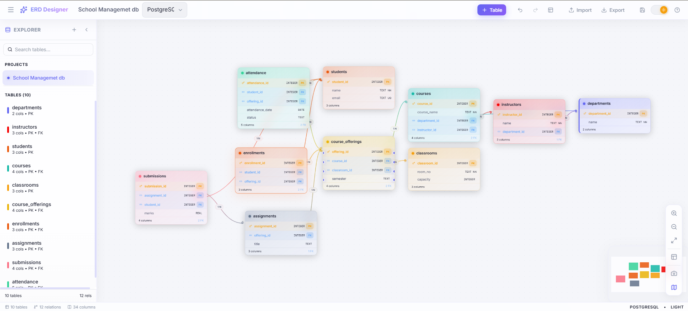

<div align="center">

# 🌌 Database Schema Studio

**A production-ready, local-first database design tool with a premium glassmorphic aesthetic.**

[](https://opensource.org/licenses/MIT)
[]()
[]()
[]()
[]()
[]()
[]()

<br />



*Design, visualize, analyze, and generate complex database schemas entirely within your browser—no backend or installation required.*

</div>

---

## 📑 Table of Contents

- [Introduction](#-introduction)
- [Enterprise-Grade Features](#-enterprise-grade-features)
  - [The Magic Flow (I/O)](#the-magic-flow-io)
  - [Visual Experience](#visual-experience)
  - [Data Engineering](#data-engineering)
- [Quick Start](#-quick-start)
- [Architecture & Tech Stack](#-architecture--tech-stack)
- [Keyboard Shortcuts](#-keyboard-shortcuts)
- [Contributing](#-contributing)
- [License](#-license)

---

## 🚀 Introduction

**Database Schema Studio** is engineered for modern development teams, software architects, and database administrators. Built with a focus on **privacy, performance, and aesthetics**, it eliminates the friction of database design by allowing you to intuitively model complex relationships and constraints through a highly responsive visual canvas. 

Because it operates entirely **local-first** in the browser, your proprietary schemas are never transmitted to a remote server.

---

## ✨ Enterprise-Grade Features

### ⚡ The Magic Flow (I/O)
- **📥 Instant Reverse Engineering**: Paste raw SQL DDL scripts or import an existing `.db` file, and the engine will instantly parse and generate a visual ERD diagram.
- **🔄 One-Click Conversions**: Export your visual models into production-ready `CREATE TABLE` and `ALTER TABLE` scripts for **PostgreSQL**, **MySQL**, **MSSQL**, and **SQLite**.
- **📦 WebAssembly SQLite Compiler**: Leverage `sql.js` to compile and export physical, fully-functioning SQLite `.db` files directly from the browser context.
- **📸 High-Fidelity PNG Export**: Export retina-ready (`2x`) transparent PNGs. Includes robust sandbox bypass mechanisms for reliable documentation exports.

### 🎨 Visual Experience
- **Glassmorphic Aesthetic**: A premium, translucent UI with ambient background glows, micro-animations, and high-fidelity typography designed to reduce cognitive load.
- **High-Performance Canvas**: Built on `@xyflow/react` to handle massive topological spaces with buttery-smooth panning, zooming, and node dragging.
- **Smart Auto-Layout**: Complex schemas? One click triggers the `dagre` layout engine to intelligently untangle nodes and minimize edge intersections.
- **Dynamic Gradient Routing**: Relationship edges automatically inherit and interpolate smooth SVG gradients between parent and child tables.

### 🛠️ Data Engineering
- **M:N Automation**: Drag-and-drop handles between columns. Defining a Many-to-Many relationship automatically provisions the intermediary junction table and its composite keys.
- **Granular Constraints**: Comprehensive support for Primary Keys (PK), Foreign Keys (FK), Unique (UQ), Not Null (NN), and Auto-Increment variables.
- **Debounced IndexedDB Persistence**: Your workspace state is immutable, heavily debounced, and continuously flushed to `IndexedDB` to ensure zero data loss across sessions.

---

## 📖 Quick Start

### Prerequisites
- Node.js `v18.0.0` or higher
- npm `v9.0.0` or higher

### Local Installation

```bash
# 1. Clone the repository
git clone https://github.com/06Neel/erd-designer.git
cd erd-designer

# 2. Install Dependencies
npm install

# 3. Start the Development Server
npm run dev
```

Navigate to `http://localhost:5173` to launch the studio locally.

---

## 🏗️ Architecture & Tech Stack

- **Core**: React 18, Vite
- **State Engine**: Zustand + Immer (Immutable state trees with debounced syncing)
- **Canvas/WebGL**: React Flow (`@xyflow/react`)
- **Data Persistence**: `idb-keyval` (IndexedDB Wrapper)
- **Parsers & Compilers**: Custom DDL Tokenizers, `sql.js` (WASM)
- **Styling**: Tailwind CSS + Vanilla CSS (for advanced backdrop-filters and hardware-accelerated animations)

---

## ⌨️ Keyboard Shortcuts

Maximize your productivity with these global hotkeys:

| Shortcut | Action |
|----------|--------|
| <kbd>Ctrl</kbd> + <kbd>L</kbd> | Run Auto-Layout Engine |
| <kbd>Delete</kbd> / <kbd>Backspace</kbd> | Delete currently selected Table or Relationship |
| <kbd>Ctrl</kbd> + <kbd>Z</kbd> | Undo last action |
| <kbd>Ctrl</kbd> + <kbd>Y</kbd> / <kbd>Ctrl</kbd> + <kbd>Shift</kbd> + <kbd>Z</kbd> | Redo last undone action |
| `Double Click` (Canvas) | Spawn a new empty Table at the cursor's location |
| `Mouse Wheel` | Pan canvas up/down |
| <kbd>Ctrl</kbd> + `Mouse Wheel` | Zoom canvas in/out |
| <kbd>Space</kbd> + `Drag` | Pan canvas (Hand tool) |

---

## 🤝 Contributing

Database Schema Studio is built by developers, for developers. We highly encourage community contributions!

1. Fork the Project
2. Create your Feature Branch (`git checkout -b feature/AmazingFeature`)
3. Commit your Changes (`git commit -m 'Add some AmazingFeature'`)
4. Push to the Branch (`git push origin feature/AmazingFeature`)
5. Open a Pull Request

Please ensure your code passes standard ESLint configurations and doesn't introduce regressions into the DDL parsers.

---

## 📜 License

Distributed under the MIT License. See `LICENSE` for more information.

<br />
<div align="center">
  <i>Engineered with modern web standards to make database architecture frictionless.</i>
</div>
